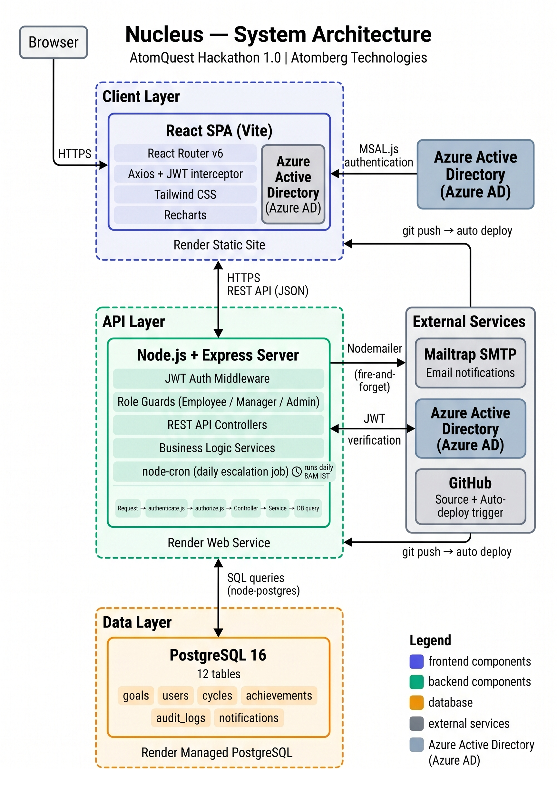

# 🪐 Nucleus — In-House Goal Setting & Performance Tracking Portal

<p align="center">
  
</p>

<p align="center">
  
  
  
  
  
  
  
</p>

---

## 🔗 Live Demo Links

*   **Frontend Dashboard:** [https://nucleus-6q6e.onrender.com](https://nucleus-6q6e.onrender.com)
*   **Backend REST API:** [https://nucleas-api.onrender.com](https://nucleas-api.onrender.com)

> [!NOTE]  
> The backend runs on Render's free tier. If the app takes ~30 seconds to load on your first visit, the server is waking up from an idle state. This is expected behavior on the free tier — navigation will be instant right after waking.

---

## 🔑 Demo Access Credentials

| Role | Email | Password |
| :--- | :--- | :--- |
| **Admin / HR** | `admin@nucleas.com` | `Admin@123` |
| **Manager (L1)** | `manager@nucleas.com` | `Manager@123` |
| **Employee 1** | `employee@nucleas.com` | `Employee@123` |
| **Employee 2** | `employee2@nucleas.com` | `Employee@123` |

### 📊 Pre-Seeded Demo Scenario
The database is fully pre-seeded with rich, realistic data to demonstrate a complete goal cycle workflow out of the box:
*   **Aarav Singh (Employee 1)** has 5 approved goals, with Q1 actual achievement values already submitted.
*   **Meera Patel (Employee 2)** has goals in a submitted state, waiting for manager review/approval.
*   **Rahul Verma (Manager)** has 2 personal goals approved, plus manages both Aarav and Meera.
*   **Shared Company KPI:** A global target pushed by Admin is visible across both employee dashboards.
*   **Audit Trail & Escalations:** 16 detailed audit log entries and an active escalation history are pre-populated.

---

## 🧠 What is Nucleus?

**Nucleus** is an end-to-end employee goal management portal that replaces chaotic spreadsheet-based performance tracking with a structured, auditable, role-aware system. It bridges the gap between organizational objectives and individual execution across the entire performance cycle:

```
Goal Setting ──> Manager Approval ──> Quarterly Check-ins ──> Analytics & Reports
```

Every view is entirely scoped to the logged-in role:
*   **Employees** enjoy secure workspace sandboxes with no visibility into peers.
*   **Managers** only oversee direct reports, with seamless context toggles.
*   **HR / Admins** maintain full org-wide compliance, settings control, and audit logs.

---

## 🎯 The Problem It Solves

Most organizations track employee goals in Excel sheets or scattered email threads. This creates four critical issues:

1.  **No Accountability** — Goals get set in April and are completely forgotten by July.
2.  **No Auditability** — No record exists of who changed what, when, or why.
3.  **No Real-Time Visibility** — HR has no idea who has submitted goals and who hasn't without manual chasing.
4.  **No Score Standardization** — Managers compute achievement percentages differently, skewing performance data.

**Nucleus solves all four.** Goals are locked securely after approval, every modification logs an immutable audit trail, HR has a live completion dashboard, and scores are computed through the exact same standard formulas for everyone.

---

## ⚙️ Key Feature Highlights

### 🧑‍💼 For Employees
*   **Goal Caps & Balancing:** Create up to 8 goals per cycle with a smart weightage calculator that must sum to exactly 100%.
*   **Interactive Weightage Gauge:** A live visual ring turns green at 100% and red if goals are unbalanced.
*   **Flexible Metric Types (UoMs):**
    *   *Higher is Better* (e.g., Sales Revenue) — `Score = Actual ÷ Target`
    *   *Lower is Better* (e.g., Turnaround Time, Cost) — `Score = Target ÷ Actual`
    *   *Date-Based* (e.g., Project Delivery) — `100%` if on time, `50%` if late.
    *   *Zero = Success* (e.g., Safety Incidents) — `100%` if zero, `0%` otherwise.
*   **Live Check-in Preview:** A dynamic check-in form with live score preview as you type actual values.
*   **Rework Loops:** Goals returned for rework display the manager's comment inline for clear correction guidance.

### 👥 For Managers
*   **Role Switcher:** Switch between "My Goals" (as employee) and "My Team" (as manager) inside a single session without logging out.
*   **Smart Approval Queue:** Review submitted sheets with full inline editing of targets/weightage prior to approval.
*   **Bulk Actions:** Approve an entire employee's goal list in one click.
*   **Structured Check-ins:** Log structured comments per goal, per quarter.
*   **Team Analytics:** Dynamic bar charts displaying average scores across all direct reports.

### 👑 For Admin / HR
*   **Cycle Management:** Configure active cycles with precise dates for goal-setting and quarterly check-in windows.
*   **Cascading Shared Goals:** Push standard corporate goals to multiple employees. Achievement updates on the parent automatically cascade down to child goals.
*   **Unlock with Cause:** Unlock approved goals for correction; a mandatory reason field keeps the audit log compliant.
*   **Completion Dashboards:** Real-time visual metrics tracking submissions, approvals, and check-in completion.
*   **Audit Logging:** Full paginated audit log with timestamps, modified fields, IP addresses, and old vs. new values.
*   **Direct Exports:** One-click spreadsheet export for all active achievement records (CSV & Excel formats).

---

## 🚀 Advanced Bonus Features

### 📧 Fire-and-Forget Email Notifications
Five key trigger points are integrated with **Nodemailer** using a Dev-Safe, non-blocking asynchronous pattern (failures never crash the API or slow down user interactions):
*   **Goal Submission:** Manager gets notified when an employee submits goals.
*   **Goal Approval:** Employee gets notified when goals are approved.
*   **Rework Request:** Employee gets notified with inline manager feedback.
*   **New Goal Cycle:** All employees are notified when a new cycle opens.
*   **Escalations:** Managers and HR are notified when thresholds are breached.

### ⏰ Automated Escalation Engine
An active `node-cron` background job runs daily at **8:00 AM** and evaluates three configurable rules against the database:
*   *Goals not submitted* N days after a cycle opens.
*   *Goals not approved* N days after an employee submits them.
*   *Check-ins not completed* during an active quarter window.

Every escalation is logged to `escalation_logs` mapping the target employee, notified manager, violated rule, and breach reason.

### 📊 Rich Analytics Module
A comprehensive suite of four interactive charts available at `/admin/analytics`:
*   **QoQ Trend:** Line chart showcasing average scores per quarter across employees and teams.
*   **Completion Heatmap:** Matrix plotting departments × quarters, with color intensity scaling with completion rates.
*   **Goal Distribution:** Pie charts illustrating thrust areas and bar charts mapping UoM types.
*   **Manager Effectiveness:** Performance overview measuring check-in completion rates per L1 manager.

### 🛡️ Microsoft Azure AD SSO
Complete OAuth 2.0 / OIDC login flow via `@azure/msal-node`. Users can log in with their corporate Microsoft accounts. The backend matches the Microsoft email against the database and issues a secure JWT. New Microsoft emails are auto-provisioned as employees and can be managed directly by HR.

---

## 🛠️ Technology Stack

| Layer | Technology | Key Choice Rationale |
| :--- | :--- | :--- |
| **Frontend** | React 18 + Vite | Hyper-fast build pipelines and minimal bundle sizes. |
| **Styling** | Tailwind CSS | Utility-first architecture enabling clean, unified design tokens. |
| **Charts** | Recharts | Declarative, highly-customizable SVG charts. |
| **HTTP Client** | Axios | Interceptors for seamless, automated JWT header injection. |
| **Backend** | Node.js 20 + Express 4 | High-performance, event-driven JavaScript end-to-end. |
| **Database** | PostgreSQL 16 | Relational consistency, robust constraints, and ACID compliance. |
| **DB Client** | node-postgres (`pg`) | Lightweight, high-performance driver without heavy ORM abstractions. |
| **Auth** | JSON Web Tokens (JWT) | Secure, stateless, role-encoded payload authorization. |
| **SSO** | `@azure/msal-node` | Secure Enterprise Microsoft authentication. |
| **Hashing** | `bcrypt` | Industry-standard salted hashing for secure password storage. |
| **Email** | Nodemailer | Asynchronous, dev-safe email dispatching. |
| **Scheduler** | `node-cron` | Lightweight, in-process cron job scheduler. |
| **Data Exports** | `exceljs` & `json2csv` | High-fidelity, formatted Excel and lightweight CSV generator. |
| **Hosting** | Render | Complete 3-tier static site, web service, and managed DB stack. |

---

## 📐 System Architecture

### 📊 Technical Diagram
The application follows a standard secure 3-tier architecture separating the presentations, application services, and persistent database layers:



---

## 🗄️ Database Schema Design

The system relies on **12 interconnected relational tables** built to enforce compliance, auditability, and data security:

```
users               — Employee directory, roles, and manager hierarchy
goal_cycles         — Annual cycles mapping phase1 + Q1-Q4 active date windows
thrust_areas        — Strategic corporate categories per cycle
goals               — Employee goal records with UoMs, weightages, and statuses
goal_achievements   — Plan vs. actual achievement progress logs per goal per quarter
manager_checkins    — Manager evaluation logs and check-in comments per quarter
audit_logs          — Compliance log capturing pre/post values, IPs, and reasons
notifications       — User-specific inside-app alert logs
escalation_rules    — Configurable escalation rules and day thresholds
escalation_logs     — Chronological history of every system escalation fired
```

### 🔒 Architectural Safeguards
*   **Security Lock:** Once a manager approves a goal list, the backend writes `is_locked = TRUE` to the database. All subsequent `PUT/DELETE` requests return a `403 Forbidden` unless unlocked by Admin.
*   **Cascading Shared Goals:** Child goals maintain a foreign key reference to their `parent_goal_id`, triggering automatic cascade updates for team-wide targets.
*   **Compliance Audit:** The `audit_logs` capture exact changed fields, user actor details, before-and-after values, and the initiating user's IP.
*   **Secure Identifiers:** All table primary keys are generated as secure `UUIDv4` values rather than sequential integers to prevent record counting attacks.

---

## 🛣️ API Routing Reference

Our RESTful API exposes **45 core endpoints** grouped into 6 service domains:

| Domain Router | Base Path | Functionality Scope |
| :--- | :--- | :--- |
| **Auth** | `/api/auth` | Login, logout, session verification, Microsoft SSO |
| **Goals** | `/api/goals` | CRUD, submission, thrust areas, active cycles |
| **Achievements** | `/api/achievements` | Log quarterly actual achievements per goal |
| **Manager** | `/api/manager` | Direct reports dashboard, approval queues, check-ins |
| **Admin** | `/api/admin` | Create cycles, provision users, push shared targets, unlocks |
| **Reports** | `/api/reports` | Analytics datasets, QoQ score exports (Excel/CSV) |
| **Notifications** | `/api/notifications` | In-app alerts, read status toggling, unread counts |

### ✉️ Standard Response Envelope
```json
{
  "success": true,
  "data": {
    "id": "c1f72a49-923f-42e8-92f7-b89291129f1b",
    "status": "approved"
  },
  "message": "Goal approved successfully"
}
```

---

## 🧮 Score Calculation Formula

The performance index calculation runs identical sync engines in both layers: **Backend** (for reporting/export services via `score.service.js`) and **Frontend** (for live UI scoring indicators via `scoreCalc.js`).

| UoM Type | Formula | Target Example |
| :--- | :--- | :--- |
| **Higher is Better** | `Score = Actual ÷ Target` | 90 Revenue achieved / 100 Target = **90%** |
| **Lower is Better** | `Score = Target ÷ Actual` | 100 Days Target / 80 Days Actual = **125%** |
| **Timeline-Based** | On Time = `100%`, Late = `50%` | Completed before Target Date = **100%** |
| **Zero = Success** | `Actual = 0` → `100%`, else `0%` | 0 Incidents logged = **100%** |

*   **Cap Limits:** Individual achievement metrics are capped at **150%** to account for overachievement without skewing metrics.
*   **Balanced Overall Score:** `Overall Score = Sum of (Goal Score × Weightage %)`

---

## 📁 Repository File Structure

```
nucleus/
├── client/                  # React Frontend SPA (Vite Dev Server)
│   ├── src/
│   │   ├── pages/           # Employee, Manager, and Admin dashboards & workflows
│   │   ├── components/      # Common components, forms, gauges, and wrappers
│   │   ├── services/        # Axios API fetch requests
│   │   ├── hooks/           # useAuth, useGoals, and useCycle
│   │   ├── context/         # AuthContext providing global session state
│   │   └── utils/           # Shared calculators, formatters, and utility functions
│   └── public/
│       └── _redirects       # Single-Page App redirect rules for Render Router
│
└── server/                  # Node.js + Express Backend API
    ├── src/
    │   ├── routes/          # Express route definitions (SSO, admin, goals, etc.)
    │   ├── controllers/     # Route controller handlers
    │   ├── services/        # Business logic services (Scores, Audit, Emails)
    │   ├── middleware/      # Auth, Role-Guards, and logging middleware
    │   ├── config/          # Database Pool (pg) and Azure MSAL initializers
    │   └── jobs/            # Escalation engine scheduler (node-cron)
    ├── migrations/          # 10 sequential database migration files
    └── scripts/             # Database migrate and pre-seed script files
```

---

## 👥 Core Project Team

*   **Engineering Lead:** Built solo for the AtomQuest Hackathon 1.0.

---

## 📄 License

Distributed under the **MIT License**. See `LICENSE` for more information.